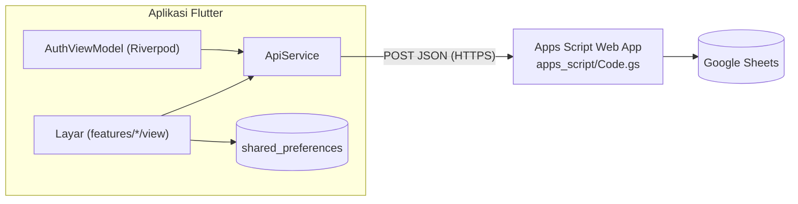
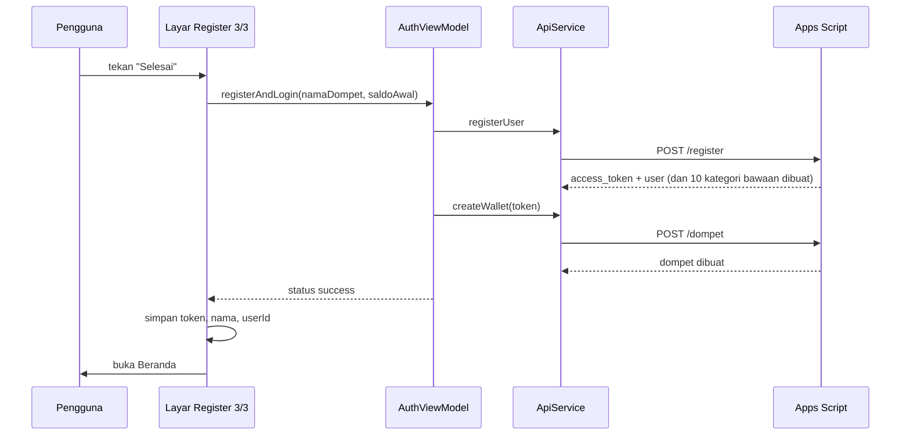

# Arsitektur

## Gambaran besar

Aplikasi tidak punya server sendiri. Semua permintaan data lewat satu kelas, `ApiService`, ke satu URL Apps Script. Detailnya ada di [Backend Google Sheets](Backend-Google-Sheets.md).

## Struktur folder

| Folder | Isi |
|---|---|
| `lib/main.dart` | Titik masuk, `ProviderScope`, tema, dan seluruh rute bernama |
| `lib/core/` | `app_theme.dart`: warna dan gaya bersama |
| `lib/data/model/` | Kelas data: `Wallet`, `Category`, `Transaction`, `User`, masing-masing dengan `fromJson` |
| `lib/data/services/` | `ApiService`: semua panggilan ke backend |
| `lib/features/<fitur>/view/` | Layar (widget) |
| `lib/features/auth/viewmodel/` | `AuthViewModel` dan `AuthState` |
| `lib/shared/widget/` | Widget umum |

Fitur yang ada: `splash`, `onboarding`, `auth`, `home`, `transaksi`, `ringkasan`, `profile`.

## State management

Ada dua gaya yang dipakai berdampingan:

- **Riverpod (`StateNotifier`)** hanya untuk alur autentikasi. `AuthViewModel` menampung data pendaftaran 3 langkah (`name`, `email`, `password`, `currencyCode`) dan status `initial`, `loading`, `success`, `error`. Layar register dan login mendengarkannya dengan `ref.listen`.
- **`StatefulWidget` + `setState`** untuk semua layar lain. Tiap layar membuat `ApiService` sendiri, memuat data di `initState`, dan menyimpannya di variabel state lokal.

## Navigasi

Semua rute didaftarkan di `MaterialApp.routes`. Satu rute dinamis, `/transaction-detail/<id>`, ditangani `onGenerateRoute`. Perpindahan setelah login, register, dan splash memakai `pushNamedAndRemoveUntil` agar tombol kembali tidak membawa pengguna ke layar autentikasi.

## Penyimpanan lokal

Disimpan lewat `shared_preferences`:

| Kunci | Isi | Ditulis saat |
|---|---|---|
| `authToken` | Token sesi dari server | Login dan register berhasil |
| `name` | Nama pengguna untuk sapaan | Login dan register berhasil |
| `userId` | Id pengguna | Login dan register berhasil |
| `initialBalance` | Salinan terakhir total saldo, dipakai saat data server gagal dimuat | Beranda berhasil memuat data |

`authToken` menentukan layar pertama: jika ada, Splash langsung ke Beranda. Saat **Keluar**, hanya `authToken` dan `name` yang dihapus; `userId` dan `initialBalance` tetap tersimpan dan akan ditimpa saat pengguna masuk lagi.

## Alur data: pendaftaran

## Memuat data layar

Beranda, Transaksi, dan Ringkasan membutuhkan dompet, transaksi, dan kategori sekaligus. Ketiganya diminta **paralel** dengan `Future.wait`, bukan berurutan, karena setiap request ke Apps Script punya waktu tunggu tetap. Lihat [Kuota dan Performa](Kuota-dan-Performa.md).

## Tema dan lokal

- Warna utama `#5D9E85`, warna sekunder `#C0EAD8` (`AppTheme`).
- Tanggal dan bulan memakai lokal `id_ID` lewat paket `intl`.
