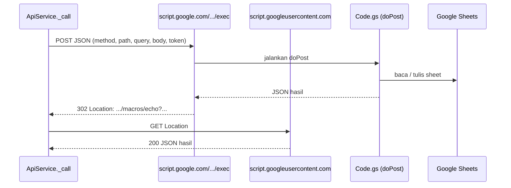

# Backend Google Sheets

Backend Ringkas adalah satu berkas Google Apps Script, [`apps_script/Code.gs`](../../apps_script/Code.gs), yang di-deploy sebagai **Web App** dan membaca serta menulis ke sebuah Google Spreadsheet. Aplikasi hanya mengenal satu URL, yaitu URL `/exec` dari deployment itu.

## Cara kerja



Script berjalan pada tahap POST. Tahap GET hanya mengambil hasilnya.

### Kenapa semua request berupa POST ke satu URL?
Apps Script Web App punya tiga batasan yang membuat REST biasa tidak bisa dipakai:

1. Hanya ada `doGet` dan `doPost`, jadi tidak ada `PUT` atau `DELETE`.
2. Header `Authorization` tidak bisa dibaca script.
3. Status HTTP selalu 200. Keberhasilan dinilai dari isi JSON.

Karena itu aplikasi membungkus setiap permintaan REST (`method`, `path`, `query`, `body`) ke dalam satu POST, dan token dikirim di dalam body.

### Redirect
Apps Script menjawab POST dengan **302** ke `script.googleusercontent.com`. Hasil sebenarnya diambil dengan `GET` ke alamat pada header `Location`. `ApiService._call` menangani ini otomatis (maksimal 3 kali).

## Format permintaan

```json
{
  "method": "POST",
  "path": "/transaksi",
  "query": {},
  "body": { "category_id": 3, "dompet_id": 1, "trx_date": "2026-09-20 12:15:00", "amount": 25000, "note": "Makan siang" },
  "token": "<access_token>"
}
```

Header yang dikirim: `Content-Type: text/plain; charset=utf-8` (agar tidak memicu preflight CORS di web).

## Format respons

Berhasil:

```json
{ "status": "success", "message": "OK", "data": { } }
```

Gagal (HTTP tetap 200):

```json
{ "status": "error", "message": "Email atau password salah" }
```

`ApiService._call` melempar `Exception(message)` untuk semua respons dengan `status` selain `success`, dan untuk respons yang bukan JSON (misalnya halaman HTML dari Google karena URL salah).

## Autentikasi

1. `/register` dan `/login` menghasilkan `access_token`, yaitu dua UUID digabung.
2. Token disimpan di sheet `sessions` (`token`, `user_id`, `created_at`) dan di cache script selama 6 jam agar request berikutnya tidak perlu membaca sheet.
3. Semua endpoint selain register dan login mensyaratkan `token`. Jika tidak dikenal, jawabannya `Unauthenticated`.
4. Pemilik data selalu ditentukan dari token. Kolom `user_id` yang dikirim aplikasi diabaikan.

Password disimpan sebagai `SHA-256(salt + password)` dengan `salt` acak per pengguna. Lihat [Keamanan](Keamanan.md).

## Daftar endpoint

`path` di bawah dikirim di dalam body permintaan. `{id}` adalah id baris.

### Akun

| Method | Path | Body | Hasil |
|---|---|---|---|
| POST | `/register` | `name`, `email`, `password` | `access_token`, `user`. Juga membuat 10 kategori bawaan. |
| POST | `/login` | `email`, `password` | `access_token`, `user` |
| GET | `/users` | | Data pengguna yang sedang login (`id`, `name`, `email`, `created_at`) |

### Dompet

| Method | Path | Body | Hasil |
|---|---|---|---|
| GET | `/dompet` | | `data.dompets[]` (dengan `current_balance`) dan `data.total_current_balance` |
| POST | `/dompet` | `name`, `currency`, `initial_balance` | `data`: dompet baru |
| PUT | `/dompet/{id}` | `name`, `currency`, `initial_balance` | `data`: dompet terbaru |
| DELETE | `/dompet/{id}` | | Menghapus dompet **dan semua transaksinya** |

### Kategori

| Method | Path | Body | Hasil |
|---|---|---|---|
| GET | `/kategori` | | `data[]` |
| POST | `/kategori` | `name`, `kind` (`income` atau `expense`), `color`, `icon` | `data`: kategori baru |
| PUT | `/kategori/{id}` | `name`, `kind`, `color`, `icon` | `data` |
| DELETE | `/kategori/{id}` | | Ditolak jika masih dipakai transaksi |

### Transaksi

| Method | Path | Query / Body | Hasil |
|---|---|---|---|
| GET | `/transaksi` | Query opsional: `start_date`, `end_date` (`yyyy-MM-dd`), `search`, `dompet_id`, `category_id` (boleh beberapa, dipisah koma) | `data.transaksi[]`, `saldo_awal`, `saldo_akhir`, `total_transaksi` (jumlah baris hasil) |
| GET | `/transaksi/{id}` | | `data`: satu transaksi |
| POST | `/transaksi` | `category_id`, `dompet_id`, `trx_date`, `amount`, `note` | `data` |
| PUT | `/transaksi/{id}` | Kolom yang sama, boleh sebagian | `data` |
| DELETE | `/transaksi/{id}` | | |

Setiap transaksi pada respons diperkaya dengan `kategori_name`, `kind`, dan `dompet_name`.

`saldo_awal` adalah jumlah saldo awal semua dompet ditambah efek transaksi sebelum `start_date`. `saldo_akhir` adalah `saldo_awal` ditambah efek transaksi dalam hasil.

## Validasi di server

- Header baris 1 setiap sheet harus sama dengan skema. Jika tidak, jawabannya `Header sheet "x" salah. Baris 1 harus: ...`.
- Email unik, disimpan huruf kecil.
- Saat membuat kategori, `kind` hanya boleh `income` atau `expense`.
- Transaksi harus memakai kategori dan dompet milik pengguna itu, dengan `amount` lebih dari 0.

## Konkurensi

Request yang menulis (semua selain GET, termasuk login dan register) memakai `LockService` sehingga antre satu per satu, lalu `SpreadsheetApp.flush()` dipanggil sebelum kunci dilepas. Request `GET` tidak memakai kunci dan bisa berjalan bersamaan.

## Cara menambah endpoint

1. Di `Code.gs`, tambahkan cabang di `route()` atau di fungsi `xxxApi` yang sesuai.
2. Di `ApiService`, tambahkan method yang memanggil `_call(method, path, ...)`.
3. Deploy **versi baru** dari deployment yang sama. Lihat [Setup Backend](Setup-Backend.md#memperbarui-kode).
