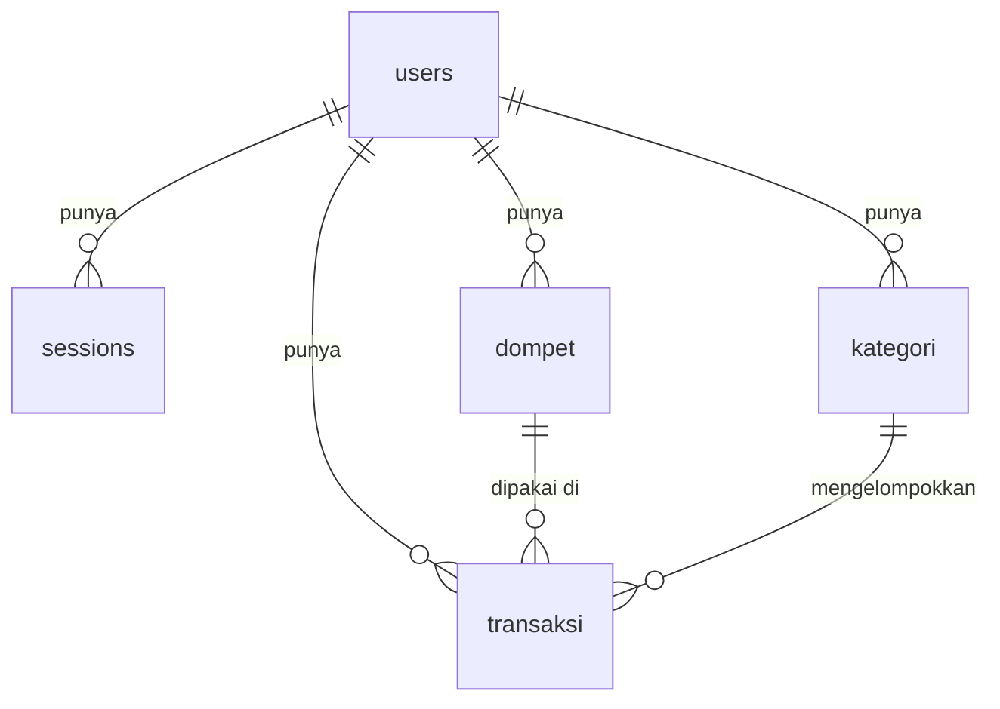

# Struktur Spreadsheet

Spreadsheet berisi lima sheet. Sheet dan header-nya dibuat otomatis oleh fungsi `setup()` di `Code.gs` (lihat [Setup Backend](Setup-Backend.md)).

> **Jangan mengubah nama sheet maupun baris 1 (header).** Script membaca kolom berdasarkan nama header. Jika header berubah, semua request gagal dengan pesan `Header sheet "x" salah`.

## Relasi antar sheet

## users

Satu baris per akun.

| Kolom | Tipe | Contoh | Keterangan |
|---|---|---|---|
| `id` | angka | `1` | Nomor urut, dibuat otomatis. Jangan diubah manual. |
| `name` | teks | `Budi Santoso` | Nama lengkap dari form daftar. |
| `email` | teks | `budi@mail.com` | Untuk login. Disimpan huruf kecil dan harus unik. |
| `password_hash` | teks | `9f86d081884c7d65...` | `SHA-256(salt + password)`. Password asli tidak disimpan. |
| `salt` | teks | `3f2a9c1e-...` | Teks acak per pengguna yang dicampur ke password sebelum di-hash. |
| `created_at` | teks | `2026-09-20 10:30:00` | Waktu mendaftar. |

## sessions

Satu baris per login atau register yang berhasil. Baris ini yang membuat token dikenali.

| Kolom | Tipe | Contoh | Keterangan |
|---|---|---|---|
| `token` | teks | `a1b2c3d4-...` | Kunci login yang dikirim aplikasi di setiap request. |
| `user_id` | angka | `1` | Pemilik token, mengacu ke `users.id`. |
| `created_at` | teks | `2026-09-20 10:30:00` | Waktu token dibuat. |

Token belum punya masa berlaku. Sesi yang `user_id`-nya kosong tidak bisa dipakai (jawabannya `Unauthenticated`).

## dompet

| Kolom | Tipe | Contoh | Keterangan |
|---|---|---|---|
| `id` | angka | `1` | Dibuat otomatis. |
| `user_id` | angka | `1` | Pemilik, mengacu ke `users.id`. |
| `name` | teks | `Tunai` | Nama dompet. |
| `currency` | teks | `IDR` | Kode mata uang. |
| `initial_balance` | angka | `500000` | Saldo awal. **Saldo saat ini tidak disimpan**, tetapi dihitung script: saldo awal + pemasukan - pengeluaran. |
| `is_active` | benar/salah | `TRUE` | Status dompet. |
| `created_at` | teks | `2026-09-20 10:30:00` | |
| `updated_at` | teks | `2026-09-21 08:00:00` | |

## kategori

| Kolom | Tipe | Contoh | Keterangan |
|---|---|---|---|
| `id` | angka | `1` | Dibuat otomatis. |
| `user_id` | angka | `1` | Pemilik. Setiap pengguna punya kategori sendiri. |
| `parent_id` | angka | *(kosong)* | Untuk sub-kategori. Belum dipakai aplikasi. |
| `name` | teks | `Makanan & Minuman` | |
| `kind` | teks | `expense` | `income` (pemasukan) atau `expense` (pengeluaran). Menentukan apakah transaksi menambah atau mengurangi saldo. |
| `color` | teks | `#FF7043` | Kode warna hex. |
| `icon` | teks | `restaurant` | Nama ikon yang dikenali aplikasi (lihat `icon_picker_page.dart`). |
| `created_at` | teks | `2026-09-20 10:30:00` | |

### Kategori bawaan

Setiap pengguna baru otomatis mendapat 10 kategori saat mendaftar:

| Jenis | Kategori |
|---|---|
| Pengeluaran | Makanan & Minuman, Transportasi, Belanja, Tagihan, Hiburan, Kesehatan, Pendidikan |
| Pemasukan | Gaji, Bonus, Investasi |

Kategori ini adalah kategori biasa milik pengguna, jadi bisa diubah dan dihapus. Daftarnya ada di konstanta `DEFAULT_CATEGORIES` pada `Code.gs`.

## transaksi

| Kolom | Tipe | Contoh | Keterangan |
|---|---|---|---|
| `id` | angka | `1` | Dibuat otomatis. |
| `user_id` | angka | `1` | Pemilik. |
| `category_id` | angka | `3` | Mengacu ke `kategori.id`. Dari sini diketahui pemasukan atau pengeluaran. |
| `dompet_id` | angka | `1` | Mengacu ke `dompet.id`. |
| `trx_date` | teks | `2026-09-20 12:15:00` | Tanggal transaksi. Script hanya memakai 10 karakter pertama (`yyyy-MM-dd`) untuk filter. |
| `amount` | angka | `25000` | Selalu positif. Tanda ditentukan oleh `kind` kategori. |
| `note` | teks | `Makan siang` | Catatan bebas. |
| `created_at` | teks | `2026-09-20 12:15:00` | |
| `updated_at` | teks | `2026-09-20 12:15:00` | |

## Aturan penting

- Kolom `id`, `created_at`, dan `updated_at` diisi otomatis oleh script. Jangan diisi manual.
- Kolom tanggal berformat teks agar Google Sheets tidak mengubahnya menjadi tanggal. Fungsi `setup()` mengatur format ini.
- Menghapus baris di sheet secara manual tidak menghapus data yang berelasi (misalnya menghapus dompet tidak menghapus transaksinya). Lakukan penghapusan lewat aplikasi bila memungkinkan.
- Sheet `users` dan `sessions` berisi data sensitif. Jangan bagikan spreadsheet ini. Lihat [Keamanan](Keamanan.md).
